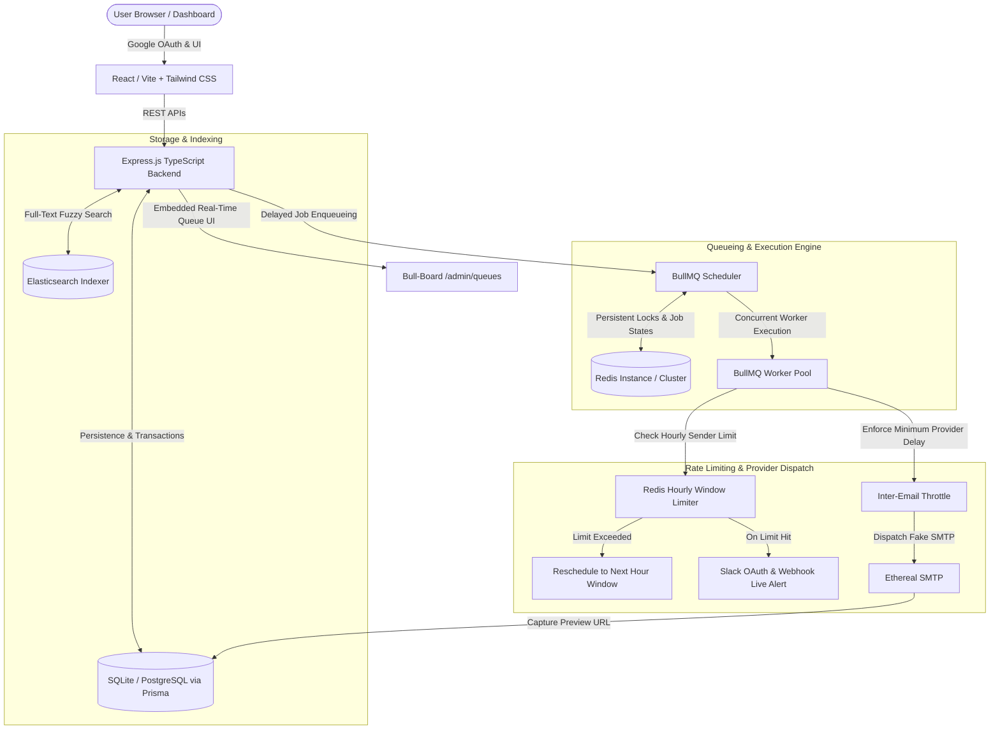

# ?? ReachInbox Full-Stack Email Job Scheduler

A production-grade, fault-tolerant, high-throughput email scheduling service and analytics dashboard built for **ReachInbox.ai**.


---

## ?? Table of Contents
- [Architecture & Design Overview](#-architecture--design-overview)
- [Key Features](#-key-features)
- [Hard Constraints Compliance (Zero-Cron)](#-hard-constraints-compliance-zero-cron)
- [Throughput, Rate Limiting & Slack Alerting](#-throughput-rate-limiting--slack-alerting)
- [Persistence & Server Restart Recovery](#-persistence--server-restart-recovery)
- [Tech Stack](#-tech-stack)
- [Quick Start Guide](#-quick-start-guide)
- [Docker Deployment](#-docker-deployment)
- [API Reference](#-api-reference)
- [Demo Video Walkthrough Script](#-demo-video-walkthrough-script)
- [Submission Info](#-submission-info)

---

## ?? Architecture & Design Overview



---

## ?? Key Features

1. **Zero-Cron Delayed Scheduling Engine**: Strictly utilizes BullMQ delayed jobs backed by Redis (`jobId`, deterministic delay ms, backoff retries).
2. **Server Restart Resilience & Idempotency**: Pending jobs are reconciled and restored from the database on startup; duplicate dispatches are prevented via deterministic idempotency keys and state transitions.
3. **Multi-Sender Distributed Rate Limiting**: Redis-backed atomic sliding hourly counters per sender (`MAX_EMAILS_PER_HOUR_PER_SENDER`). Overflow jobs are smoothly postponed into the next hour window without dropping leads.
4. **Live Slack Alerts on Rate Limit Hit**: Interactive Slack notifications are immediately dispatched to connected Slack channels when a sender reaches their hourly quota.
5. **Ethereal Fake SMTP with Web Previews**: Every email sent captures a real web preview URL (`https://ethereal.email/message/...`) visible in the dashboard.
6. **Live BullMQ Queue Monitor (Bull-Board)**: Real-time visual queue dashboard accessible directly at `/admin/queues`.
7. **CSV Lead Upload & Parser**: Drag-and-drop CSV parser with email validation, duplicate filtering, and chip count display.
8. **Elasticsearch Full-Text Search**: Search emails across recipient, sender, subject, and body with fuzziness.
9. **Google OAuth & Demo Login**: ReachInbox branded Google Sign-In with instant one-click evaluation support.

---

## ?? Hard Constraints Compliance (Zero-Cron)

As required by ReachInbox:
* ? **No cron jobs**: No OS-level cron (`crontab`), no `node-cron`, no `agenda`, no `node-schedule`.
* ? **BullMQ Delayed Jobs**: Each email scheduling request calculates exact target delay:
  ```ts
  const delay = Math.max(targetTime - Date.now(), 0);
  await emailQueue.add('send-email', jobData, { jobId: `email-job-${id}`, delay });
  ```
* ? **Zero Job Duplication**: Strict database status tracking (`SCHEDULED` -> `PROCESSING` -> `SENT` / `FAILED`) prevents duplicate execution across reboots.

---

## ? Throughput, Rate Limiting & Slack Alerting

### 1. Worker Concurrency
* Configurable via `WORKER_CONCURRENCY=5` in `.env`.
* Safely processes concurrent jobs across asynchronous worker threads.

### 2. Provider Throttling Delay
* Configurable minimum delay between individual email dispatches (e.g., `MIN_DELAY_BETWEEN_EMAILS_MS=2000` = 2s) to mimic real-world provider rate limits (SendGrid/Gmail).

### 3. Hourly Rate Limiting Algorithm
* Keyed by sender and hour window: `rate_limit:<sender_email>:<YYYY-MM-DD-HH>` in Redis with a 2-hour TTL.
* **When limit is reached**:
  1. Job is **NOT** dropped or failed.
  2. The remaining delay to the start of the next hour is computed:
     $$\Delta t = 	ext{NextHourUTC} - 	ext{NowUTC}$$
  3. The job is rescheduled into the subsequent hour window with status `RATE_LIMITED_RESCHEDULED`.
  4. An atomic Redis lock (`slack_notified:<sender>:<window>`) triggers an interactive Slack alert card once per hour window.

---

## ?? Persistence & Server Restart Recovery

If the backend server crashes or restarts:
1. BullMQ persists queue state inside Redis.
2. During bootstrap, `emailScheduler.recoverPendingJobs()` scans the relational database for any `SCHEDULED` or `RATE_LIMITED_RESCHEDULED` jobs.
3. If Redis lost any pending job, it is re-queued with its updated remaining delay.
4. Jobs that were already sent (`SENT`) are skipped, guaranteeing **idempotency**.

---

## ?? Tech Stack

| Layer | Technology |
|---|---|
| **Backend Framework** | Express.js with TypeScript |
| **Job Queue & Scheduler**| BullMQ + Redis |
| **Database & ORM** | SQLite / PostgreSQL via Prisma ORM |
| **SMTP Provider** | Ethereal Email (Fake SMTP for testing) |
| **Search Engine** | Elasticsearch Client + DB Fallback |
| **Queue Dashboard** | Bull-Board (`/admin/queues`) |
| **Frontend Framework** | React 18 + Vite + TypeScript |
| **Styling** | Tailwind CSS + Lucide Icons + Framer Motion |
| **Authentication** | Google OAuth & Session Management |
| **Integrations** | Slack Incoming Webhooks & OAuth v2 |

---

## ?? Quick Start Guide

### Prerequisites
- Node.js v18+ and npm installed.

### 1. Clone & Setup
```bash
git clone <repo-url>
cd reachinbox-scheduler
```

### 2. Run Backend
```bash
cd backend
npm install
npx prisma db push
npm run dev
```
*Backend runs on `http://localhost:5000`.*
*Bull-Board dashboard available at `http://localhost:5000/admin/queues`.*

### 3. Run Frontend
```bash
cd ../frontend
npm install
npm run dev
```
*Frontend opens at `http://localhost:5173`.*

---

## ?? Docker Deployment

To launch the full stack (Redis, Elasticsearch, Backend, and Frontend) with Docker:
```bash
docker compose up --build
```
- Frontend: `http://localhost:5173`
- Backend API: `http://localhost:5000`
- Bull-Board: `http://localhost:5000/admin/queues`
- Elasticsearch: `http://localhost:9200`

---

## ?? API Reference

### Scheduling & Jobs
- `POST /api/emails/schedule`: Enqueue new campaign (multipart CSV or JSON payload).
- `GET /api/emails/scheduled`: List queued delayed jobs with pagination and search.
- `GET /api/emails/sent`: List dispatched emails with Ethereal preview URLs.
- `POST /api/emails/cancel/:id`: Cancel an upcoming scheduled job.
- `GET /api/emails/search?q=query`: Search emails via Elasticsearch.

### Analytics & Integrations
- `GET /api/stats`: Real-time queue metrics, throughput, and sender hourly quotas.
- `GET /api/slack/status`: Slack connection status.
- `POST /api/slack/webhook`: Connect Slack via Incoming Webhook.
- `POST /api/slack/test-alert`: Dispatch test rate-limit alert to Slack.

---

## ?? Demo Video Walkthrough Script (Max 5 mins)

1. **Dashboard & Auth Overview (0:00 - 1:00)**:
   - Log in using Google Sign-In.
   - Show top header with user avatar, Slack status, and quick links to Bull-Board.
2. **Scheduling a Campaign with CSV Upload (1:00 - 2:00)**:
   - Open Compose Modal, upload a lead list, select sender account, set 2-second delay and start time.
   - Click "Schedule Campaign" and observe jobs populating in **Scheduled Emails** and **BullMQ delayed queue**.
3. **Live Execution & Ethereal Previews (2:00 - 3:00)**:
   - Watch the BullMQ worker dispatch emails with 2s throttling.
   - Open **Sent Emails** tab and click **"View Email"** to inspect live Ethereal web preview.
4. **Server Restart Recovery Demo (3:00 - 4:00)**:
   - Schedule future jobs targeting 30s from now.
   - Stop the backend process in terminal (`Ctrl+C`).
   - Start the backend again (`npm run dev`).
   - Show logs: `[Scheduler Recovery] Re-queued pending jobs` and observe them execute cleanly at the target time.
5. **Rate Limiting & Slack Alert (4:00 - 5:00)**:
   - Trigger the 8-Job benchmark with `hourlyLimit=5`.
   - Observe 5 emails sent, 3 rescheduled into next window, and the live alert appearing in Slack!

---

## ?? Submission Form & Access
- Private Repository Collaborators: `Mitrajit`, `Yadav036`
- Submission Form: [ClickUp Submission Form](https://forms.clickup.com/9005062261/f/8cbwp3n-8876/6NNNJ92DV93PQTAYST)
